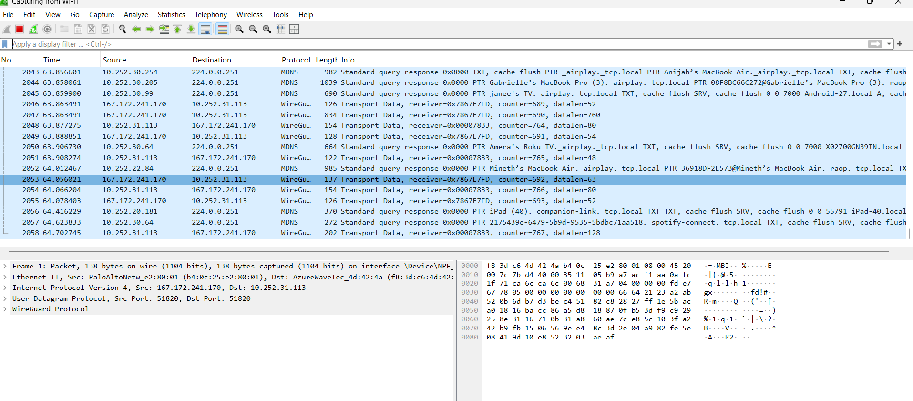

# Network Traffic Analysis Lab — Wireshark

## Objective
Capture and analyze live network traffic to understand how devices communicate across a network.

## Tools Used
- Wireshark
- Windows OS

## Steps Performed
1. Selected active network interface (Wi-Fi)
2. Captured live network traffic
3. Filtered packets using TCP protocol
4. Inspected individual packets
5. Identified source and destination IP addresses
6. Determined whether traffic was internal or external

## Findings
Observed communication between private IP addresses, indicating internal network traffic between devices on the same network.

## Skills Demonstrated
- Packet analysis
- Protocol filtering
- Network investigation
- Analytical thinking
- Cybersecurity fundamentals

## What I Learned
This lab helped me understand how network traffic flows, how analysts inspect packets, and how filtering helps isolate relevant traffic during investigations.
## Screenshots

### Live Packet Capture

### TCP Filter Applied

### Packet Details Inspection

